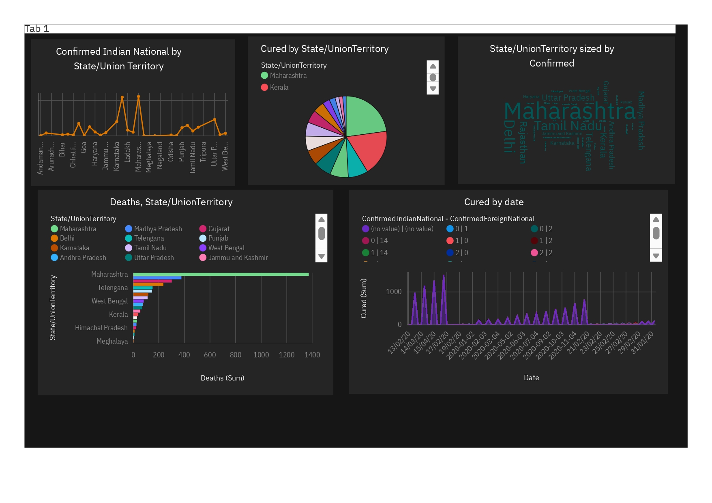

# 🦠 COVID-19 Vaccine Analytics with IBM Cognos 📊 Phase 1 [Live](https://covidvaccineanalysis.netlify.app/)

Welcome to the COVID-19 Vaccine Analytics project powered by IBM Cognos! This repository is dedicated to providing real-time insights and visualizations for COVID-19 vaccination data.

# Module 1: Introduction to Business Intelligence 👩‍💼📊

## Introduction 🚀

- Definition and Overview of Business Intelligence 📈
- The Significance of Business Intelligence in Modern Business 💼

## BI Components 🏢

- Data Sources 📂
   - Data Warehouses 🏢
   - Databases 💽
   - Spreadsheets 📄
   - External Sources 🌐
- ETL (Extract, Transform, Load) Processes 🔄
- Data Modeling and Storage 🗂️

## Data Analysis and Reporting 📈📊

- Types of Analytics 📈
   - Descriptive Analytics 📈📉
   - Diagnostic Analytics 📊📈
   - Predictive Analytics 📈🔮
   - Prescriptive Analytics 📈📚
- Reporting and Dashboard Creation 📰📋
- Data Visualization Techniques 📉📈📊

## BI Tools and Technologies 🛠️🌐

- Overview of BI Tools 🧰
   - IBM Cognos Analytics 📊💻
   - Tableau 📊📈
   - Power BI 📊🔌
   - Others 🛠️🔧
- Integration with Other Technologies 🤖🌐
   - Big Data 📈💾
   - Artificial Intelligence (AI) 🤖📚

## Business Intelligence in Decision-Making 🧐🤝

- Supporting Strategic and Operational Decisions 🧭💼
- Real-World Examples of BI Impacting Organizations 🌍📊

## Challenges and Trends in BI 🚧📈

- Data Security and Privacy 🔒📊
- Emerging BI Trends 📊🚀
   - Self-Service BI 🤳📈
   - Embedded Analytics 🧩📊

# Module 2: Working with IBM Cognos Analytics 💼💻

## Introduction to IBM Cognos Analytics 📊💡

- Overview of IBM Cognos Analytics 💡📊
- Role within the BI Ecosystem 🌐🤝

## Data Connections 📡📊

- Connecting to Various Data Sources 🌐📡
   - Databases 💽🔗
   - Spreadsheets 📄🔗
   - Web Services 🌐🔗
- Importing and Managing Data 📥💼

## Data Modeling and Preparation 🗂️✨

- Creating Data Models 🗂️🔨
- Cleaning, Transforming, and Enriching Data 🛁🔧
- Data Governance and Security 🔒🗂️

## Report Authoring 📇🖥️

- Building Reports and Dashboards 📇📊
- Using the Drag-and-Drop Interface for Data Visualization 🖱️📈
- Customizing Report Layouts and Formatting 📋🖌️

## Data Exploration and Analysis 🔍📊

- Exploring Data using Analytics Tools and Features 🔍📈🧮
- Applying Filters, Sorting, and Calculations 🧮🔍📊
- Creating Data Visualizations (Charts, Graphs, Maps) 📈📊🗺️

## Collaboration and Distribution 🤝📲

- Sharing and Collaborating on Reports and Dashboards 🤝📇📊
- Setting Up Data-Driven Alerts and Subscriptions 📲🚀📈
- Mobile Access and Distribution 📲🌐🚀

## Advanced Features 🚀🌟

- Predictive Analytics and AI Integration 🤖🔮
- Embedded Analytics for Applications 🧩💼
- Extending Cognos Analytics with Custom Solutions 🛠️🔌

## Best Practices and Optimization 📈🛠️

- Tips for Designing Efficient and Effective Reports 📈📋✨
- Performance Optimization Strategies 🚀💪

## ScreenShot

For questions, feedback, or collaboration opportunities, please reach out to [My Portfolio](https://vinaykumaradv.netlify.app/).

